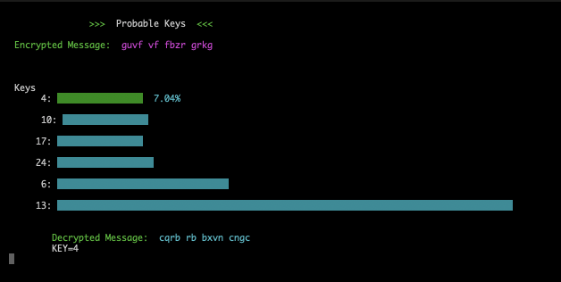

# Decrypt Caesar
This project decrypts encrypted text by analyzing the frequency of different letter pairs in the text.


## Description
#### Encryption
An integer ***rank*** (0 to 25) can be assigned to each letter of the alphabet to represents where it lies from "a" to "z". A method of encryption know as a caesar cipher takes in a string of letters, maps them to their ***rank***, adds some constant ***key*** value to each rank, and then maps these new ranks back to letters.
```python
#EXAMPLE
text = "text" #Original string of text
text_ranks = [19, 4, 23, 19] #Ranks of the letters in the original text
key = 2 #Key value to be added to the rank of each letter
new_ranks = [21, 6, 25, 21] #Ranks of the original text plus key value n=2
encrypted_text = "vgzu" #Encrypt text
```
This method of encryption results in a string of text that doesn't bare any resemblance to the original text.
#### Decryption
Decrypting a caesar cipher consist of finding what ***key*** value was used to encrypt it. Becaus the keys are all taken mod26, there are only 26 possible keys which makes it a rather trivial problem. One could simply write a script that attempts to decrypt the text with each of the 26 keys. The user could then review the output from each key to determine which was the right one. However, finding the right key with no user oversight is slightly less trivial. This requires either that the program be able to tell which of the resultant 26 strings is English text, or that the program be able to discern some pattern from the encrypted text that would reveal the key. The latter is the method used here.
Because the rank of each letter in the text is shifted by the same amount, the ***distance*** from one letter to another does not change after encryption.By distance, I mean the difference mod26 between the rank of 2 letters.

```python
#DISTANCES ARE NOT CHANGED BY ENCRYPTION
text = "text" #Text before encryption
letter_pairs = ["te", "xt"] #Text broken up into adjacent letter pairs
pair_rank = [(19, 4), (23, 19 )] #Letter pair ranks
pair_distance = [11, 22] #Distance between adjacent letters before encryption

encrypted_text = caesar(text, 2) #Encrypt the original text by adding 2 to the rank of each letter
encrypted_letter_pairs = ["vg", "zv"] #Encrypted text broken up into adjacent letter pairs
encrypted_pair_rank = [(21, 6), (25, 21)] #Encrypted letter pair ranks
encrypted_pair_distance = [11, 22] #Distance between adjacent letters after encryption is the same as distance before encryption
```
Because the distance between each adjacent letter has the same value before and after the encryption, a lot of information about the original text is preserved in these letter pairs.
Now instead of looking at our text as a string of letters that is transformed into a different string of letters, we can look at it as the set of distances between adjacent letters that undergoes no transformation. From here the question becomes what set of letter pairs result in this set of distances. This framing alone isn't much better than the original question because any particular distance can be the result of 26 different letter pairs, so our search space is still exactly the same. There is however, one key piece of information that will help us shrink the search space dramatically as well as give different weights to our options. This insight is that different letter pairs occur at different rates in English. For example, if we look at the encrypted letter pair "ui" we see that it has a distance of 11. While that could mean that this encrypted letter pair came from any of the 26 letter pairs with a distance of 11, it just so happens that about 60% of the adjacent letter pairs with a distance of 11 are "th". Assuming that this letter pair
came from an English text, we can say that there is a 60% chance that the prior to encryption, the "ui" was a "th" and that the key used to encrypt it was 1. While this is a substantial improvement over the 1/26 chance of any numbers 0 through 25 being the key, it still guesses wrong 2 out of 5 times which is far to high an error rate if we want the computer to find the key unsupervised. We can improve those odds substantially by simply analyzing more letter pairs which brings us to our final solution. For each letter pair in the encrypted text we find its distance, determine what letter pairs have the same distance, solve for the key that would transform each of those pairs to the encrypted pair, and sum the frequencies of each possible letter pair that is associated with the same possible key. This does not result in a probability, but given enough letter pairs in the encrypted text, this will result in the correct key having the highest associated value. Lastly it's valuable to note that in this program I don't actually examen every letter pair that shares the same distance with an encrypted pair. Of the 676 possible letter pairs, I only concern myself with the 40 most common even this many pairs is only necessary in order to better predict encrypted strings with as few as 4 words. With an average string of 1 or 2 sentences the model can usually guess the right key by only checking the three most common letter pairs which are "he", "th", and "in".
## Installation 
* Clone the repository
* Navigate to the directory
* (Optional) Crate your virtual environment 
* Install requirements 
```bash
pip install -r requirements.txt
```
## Usage
* Navigate into the Code subdirectory
* Run main.py in the command line
```bash
python3 main.py
```
* Fallow on screen prompts
* Enter "q" to back out to the first prompt screen and then again to quit out of the program
## Features
#### Make Your Own Model
* To make your own model to use in the decryption, save the text file that you would like to use as your training text
* Run make_model.py in the command line
```bash
python3 make_model.py
```
* Enter the relative path to your training text
* Enter the name of the file that you would like to write the model to
* Open main.py. Scroll down to the  main() function on line 118, pass the name of you model to the CryptInterface object
```python
def main():
    ci = CryptInterface("your_model_here.csv") #Pass the file name of you model here
    ci.main_loop()
```
#### Key Graph


Press `Enter` to toggle through the key graph. At the top of the graph is the encrypted text and at the bottom is the text decrypted with the selected key. When you select the correct key the decrypted text will display the original message. Enter `q` to back out of the graph to the start screen and then enter `q` again to quit.


